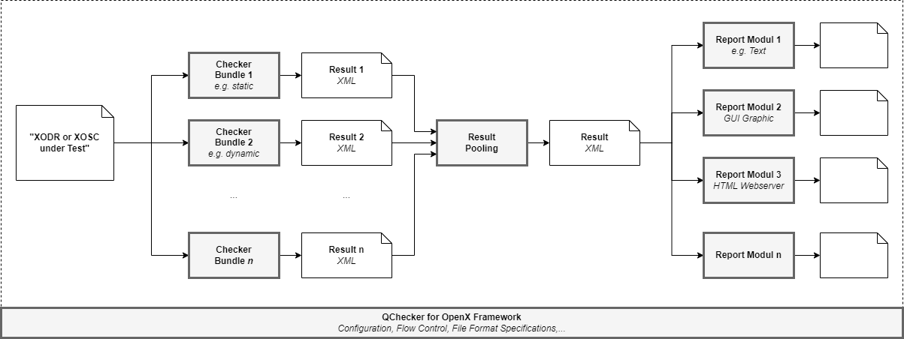

<!---
Copyright 2023 CARIAD SE.
 
This Source Code Form is subject to the terms of the Mozilla
Public License, v. 2.0. If a copy of the MPL was not distributed
with this file, You can obtain one at https://mozilla.org/MPL/2.0/.
-->

# Architecture

## High-level Requirements

The following requirement list was the foundation for the design of the framework:

- Possibility to include a common ASAM rule set, which validates the rules from the specification
  document
- Write own rule sets, implemented in any programming language
- Extract meta information (e.g. if the file contain specific objects and the location of them)
- Configuration sets and parametrization of rules
- Possibility to include results based on the analysis of simulation runs
- Human and machine readable results
- Interactive usage or run in an automated workflow
- Locate the results in the XML source code and in a visualization of the map

## Terms / Definitions

- **Route Model:** Static part of a possible concrete scenario ("Track under Test").
  - OpenDRIVE (XODR): Logical route description, exactly **one** file with extension .xodr
  - OpenSceneGraph Binary (OSGB): 3D model for usage in sensor frameworks (e. g. Visualization or
    raw data generation), exactly **one** file with extension .osgb or .ive (binary OSGB format)
  - Region-of-Interest (ROI): One or more routes in the route model that will be driven later in the
    simulation. These are "driven" in dynamic tests.
  - OpenSCENARIO (XOSC): Scenario definition, includes route definition (one file per route with
    extension .xosc)
- **Check/Checker:** A software module or routine that checks exactly one rule
  or creates statistical information from the route model. This can be a static
  or a dynamic test. For a list of possible tests, see parent page.
- **Checker Bundle:** A program or framework that includes one or more checkers. CheckerBundles
  allow checks to be better structured and divided into logical groups. A CheckerBundle also
  contains the paths to OpenSCENARIO and OpenDRIVE. This makes it possible to implement a module
  that checks both formats. In short they:
  - are a summary of several checkers
    - with similar functions
    - from one supplier
    - developed in one distinct development environment/programming language
  - allow for files only be read/prepared once via parser.
  - can be started via external scripting/automation.
- **Report or Result File:** CheckerBundles write their reports in an .xqar file. See Base Library
  and File Formats for details and examples.
- **Report Module:** Output / Transmission / Visualization Results
- **Checker Library:** Collection of Checker Bundles and/or Report Modules for one domain.

- **QC4OpenX** Framework, that:
  - feeds the route model to the individual Checker Bundles
  - selects and configures the checker
  - summarizes the results (Result Pooling)
  - calls the report modules so that the user can view or further process the results
  - provides standard checkers and standard report modules

## Workflow QC4OpenX

## Properties / Requirements

- QC4OpenX
  - Runs on Windows & Linux, Local & Server
  - Configuration via XML file
    - Selection of Checker Bundles
    - Selection of individual checkers in the bundles and their optional parameters → also defines
      the order in the overall report
    - Configuration which checkers output what level (Info/Issue) → leads to overall result "red" or
      "yellow"
    - Selection of report modules
- Checker
  - Properties
    - Optionally tunable (e.g. Limit values or chosen width for ROIs)
    - Id (short text)
    - Description (Detailed description)
- Checker Bundle
  - Runs if necessary only on certain platforms, because a third party product is not available for
    all platforms
  - Must be able to print out to the command line which checkers are included
- Result Pooling
  - Summarizes all results (overview and detailed view possible)
  - Gives each incident a unique Id → assignment results in different report modules
  - If necessary sorts and lists all information first and appends warnings and errors. Within these
    results, information is sorted by a central configuration. There is also the possibility for
    summarizing and filtering.
- Report Module
  - Runs maybe only on certain platforms (e.g. Web server or local graphical application)

## Parameterization and Sequence Control

A CheckerBundle can be parameterized. A distinction must be made between

- Globale Parameter
  - XodrFile --> OpenDRIVE file to be checked as database
  - XoscFile --> OpenSCENARIO file to be checked as database
- Parameter for the whole CheckerBundle --> "CheckerBundle Parameter"
  - Parameter that is locally relevant for this one Checker Bundle
  - If a graphical data base is checked, the .osgb/.ive file may also be used.
- Parameter for single Checkers --> "Checker Parameter"
  - Parameters that are locally relevant for one specific checker
